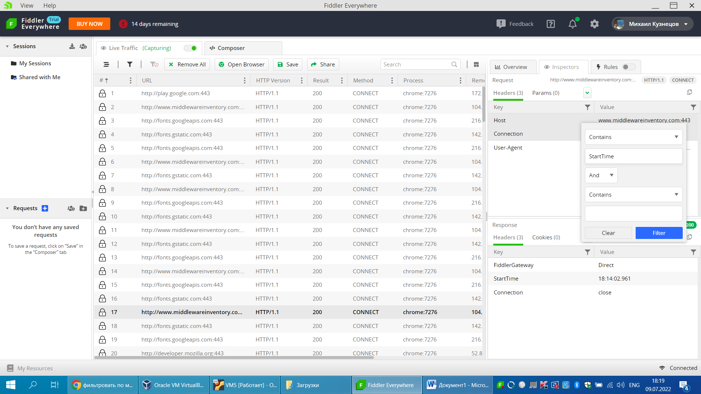

# Task2

Module 6. Thems 2.HTTP & curl Исследование HTTP протокола 
1.Найти в интернете 8 различных status code HTTP. 
В запросе и ответе должно содержаться не менее 5 header’s атрибутов. 
2.Описать назначение всех атрибутов в client request and server response. 
На примере одного из HTTP request/response описать все header’s атрибуты. 
3.Найти еще 7 различных status code. Выполнять только после выполнения задания 1. 
4.Произвести фильтрацию трафика протокола HTTP с помощью tcpdump. 
Написать два фильтра: a.фильтровать по методам протокола HTTP.  
b.фильтровать по методу и header’s атрибуту в response протокола HTTP 
c.фильтровать по методу и header’s атрибуту в request протокола HTTP 
5.Используя Fiddler выполнить пункт 4. 
6.Используя Fiddler попробовать вскрыть HTTPs.

## 2.1
1.Найти в интернете 8 различных status code HTTP. 
В запросе и ответе должно содержаться не менее 5 header’s атрибутов. 

curl -o - -I http://google.com

**-I, --head**
              (HTTP  FTP FILE) Fetch the headers only! HTTP-servers feature the command HEAD which this uses to get nothing but the header of a document. When used on an FTP or FILE file, curl dis‐
              plays the file size and last modification time only.

**-o, --output. <file>**
              Write output to <file> instead of stdout. If you are using {} or [] to fetch multiple documents, you can use '#' followed by a number in the <file> specifier. That  variable  will  be
              replaced with the current string for the URL being fetched. Like in:

               curl http://{one,two}.example.com -o "file_#1.txt"

wget http://aligajani.com -O - 2>/dev/null | grep -oP 'href="\Khttp:.+?"' | sed 's/"//' | xargs curl -I  >> test.log
-H 'Accept:aplication'

1) HTTP/1.1 **301** Moved Permanently
Server: nginx
Date: Sun, 03 Jul 2022 19:01:53 GMT
Content-Type: text/html
Content-Length: 162
Connection: keep-alive
Keep-Alive: timeout=20
Location: http://get.club/
2) HTTP/1.1 **200** OK
Content-Type: text/html
Content-Length: 3094
Connection: keep-alive
Last-Modified: Thu, 18 Apr 2019 15:50:45 GMT
Server: AmazonS3
Date: Sun, 03 Jul 2022 11:59:03 GMT
ETag: "d1264f85cadffb73ba7ac63c980e3381"
X-Cache: Hit from cloudfront
Via: 1.1 40b77149d6ba01da8c2f52c235bceed0.cloudfront.net (CloudFront)
X-Amz-Cf-Pop: BUD50-C1
X-Amz-Cf-Id: oDrqcxhPzREntswMWxq4jtH6X8g8JkEskyAP_17aXN_ZMLGzgCOEiw==
3) curl -I http://privat.ua
HTTP/1.1 **302** Moved Temporarily
Server: nginx/1.12.2
Date: Mon, 04 Jul 2022 15:59:34 GMT
Content-Type: text/html; charset=utf-8
Connection: keep-alive
X-Powered-By: PHP/5.4.16
Location: http://www.ukrrudprom.ua/tag.html?tagID=54
4) curl -o - -I http://google.com/guyjfgv
HTTP/1.1 **404** Not Found
Content-Type: text/html; charset=UTF-8
Referrer-Policy: no-referrer
Content-Length: 1568
Date: Mon, 04 Jul 2022 15:49:32 GMT
5) curl -o - -I http://ukr.net
HTTP/1.1 **403** Forbidden
Date: Mon, 04 Jul 2022 15:51:37 GMT
Content-Type: text/plain; charset=UTF-8
Content-Length: 16
Connection: keep-alive
X-Frame-Options: SAMEORIGIN
Referrer-Policy: same-origin
Cache-Control: private, max-age=0, no-store, no-cache, must-revalidate, post-check=0, pre-check=0
Expires: Thu, 01 Jan 1970 00:00:01 GMT
Set-Cookie: __cf_bm=Ui2bas5d0AZEGc6szLf9GhmOmZWAg9LdL2.1lJNeJiE-1656949897-0-AchD2GMnPUbyUdwNi7iYMB3Kzaqn07f/IqZJd+VjwIun1zk2PPAsrSEelzbIgtDwJ8WamG6M/VEqx6/zwRHCU2g=; path=/; expires=Mon, 04-Jul-22 16:21:37 GMT; domain=.ukr.net; HttpOnly; SameSite=None
Server: cloudflare
CF-RAY: 725905f99d292d67-KBP
6) HTTP/1.1 **308** Permanent Redirect
Date: Mon, 04 Jul 2022 19:05:03 GMT
Content-Type: text/html
Content-Length: 164
Connection: keep-alive
Location: https://www.quora.com/Ali-Gajani
Strict-Transport-Security: max-age=63072000; includeSubDomains; preload
X-Q-Stat: ,2a8817317ec43c2d7a4ce54ef3cb11b9,10.0.0.131,14720,176.36.183.116,,22408266953,1,1656961503.362,0.000,,.,0,0,,,,,,,284,142,10,35796,,,,,,-,
CF-Cache-Status: DYNAMIC
Set-Cookie: __cf_bm=O_u75KhpxRpecibAHfSr8PwpVF1KewEdVzWi7pAYsJc-1656961503-0-AfucbAMlF8l2Teo1Y9ceYMlFQQQun2xv8v8w5IvqBMysqbqu/vlSyf37Uq32DDSQHokZgQ00uI6HzjOP9im/xSQ=; path=/; expires=Mon, 04-Jul-22 19:35:03 GMT; domain=.quora.com; HttpOnly; SameSite=None
Server: cloudflare
CF-RAY: 725a21539de868fd-FRA
alt-svc: h3=":443"; ma=86400, h3-29=":443"; ma=86400
7) HTTP/1.1 **999** Request denied
Cache-Control: no-cache, no-store
Pragma: no-cache
Content-Length: 1530
Content-Type: text/html
Expires: Thu, 01 Jan 1970 00:00:00 GMT
Set-Cookie: trkCode=bf; Max-Age=5
Set-Cookie: trkInfo=AQEgWHmtGJhV8gAAAYHKmg8Y72zbrZXMfhG1UDQo-XBV3D4NlxxCfzGNe6-ZHpF_sf1JefFTfLk7WHSzDrQDC8mUcLPDe-Z204DmxvR2N_8p0ed8xRA5-8nKWTdNESs09GiOm0U=; Max-Age=5
Set-Cookie: rtc=AQHPCrpXN5vMvQAAAYHKmg8Yi7K5aaMt3y38KIFDo7vPt193U49f5Nf3B_ceT1ZQfaWbdi-jzP9whTA5qkuS4VXCA5GDECDSSgP__T6Sd-fGRR2g9rKkzxOaCpN84gRW73HAAGpNdqVDOSymw4FiZiN3Uce7JAZ3pyMFQmKs5Y6dzhW1X-GtOf2iI5TLHsYrgBBL2XUMskqEtHfu; Max-Age=120; path=/; domain=.linkedin.com
X-Li-Fabric: prod-lor1
X-Li-Pop: afd-prod-lor1-x
X-Li-Proto: http/1.1
X-LI-UUID: AAXi/2nMyQELLlXAm3spAg==
X-Cache: CONFIG_NOCACHE
X-MSEdge-Ref: Ref A: 0D590B3E6C0C4085998AC53B4E194163 Ref B: WAW01EDGE0405 Ref C: 2022-07-04T19:05:03Z
Date: Mon, 04 Jul 2022 19:05:02 GMT
8) curl -X POST -I www.google.com
HTTP/1.0 411 Length Required
Content-Type: text/html; charset=UTF-8
Referrer-Policy: no-referrer
Content-Length: 1564
Date: Wed, 06 Jul 2022 18:07:13 GMT
9) curl -X AAA -I http://google.com
HTTP/1.1 405 Method Not Allowed
Content-Type: text/html; charset=UTF-8
Referrer-Policy: no-referrer
Content-Length: 1588
Date: Wed, 06 Jul 2022 18:13:40 GMT

## 2.2
curl -Iv http://google.com
*   Trying 142.250.186.46:80...
* TCP_NODELAY set
* Connected to google.com (142.250.186.46) port 80 (#0)
> HEAD / HTTP/1.1                        === HTTP version 
> Host: google.com                       === Host name
> User-Agent: curl/7.68.0                === The User-Agent request header is a characteristic string that lets servers 
                                              and network peers identify the application, operating system, vendor, 
                                              and/or version of the requesting user agent.
> Accept: */*                            === The Accept request HTTP header indicates which content types, expressed 
                                                as MIME types, the client is able to understand. The server uses content 
                                                negotiation to select one of the proposals and informs the client of the 
                                                choice with the Content-Type response header. Browsers set required 
                                                values for this header based on the context of the request.
> 
* Mark bundle as not supporting multiuse
< HTTP/1.1 301 Moved Permanently          === Status code
HTTP/1.1 301 Moved Permanently            
< Location: http://www.google.com/        === Location - The Location response header indicates the URL to redirect a page to.
Location: http://www.google.com/          
< Content-Type: text/html; charset=UTF-8  === Content-Type - The Content-Type representation header is used to indicate 
                                              the original media type of the resource (prior to any content encoding 
                                              applied for sending).
Content-Type: text/html; charset=UTF-8    
< Date: Wed, 06 Jul 2022 18:31:26 GMT     === Date - The Date general HTTP header contains the date and time at which 
                                              the message originated.
Date: Wed, 06 Jul 2022 18:31:26 GMT       
< Expires: Fri, 05 Aug 2022 18:31:26 GMT  === Expires. The Expires HTTP header contains the date/time after which the response is considered expired.
Expires: Fri, 05 Aug 2022 18:31:26 GMT    
< Cache-Control: public, max-age=2592000  === Cache-Control. The Cache-Control HTTP header field holds directives 
                                              (instructions) — in both requests and responses — that control caching in 
                                              browsers and shared caches (e.g. Proxies, CDNs).
Cache-Control: public, max-age=2592000    
< Server: gws                             === Server. Server The Server header describes the software used by the origin 
                                              server that handled the request — that is, the server that generated the response.
Server: gws
< Content-Length: 219                     === Content-Length. The Content-Length header indicates the size of the message 
                                              body, in bytes, sent to the recipient.
Content-Length: 219
< X-XSS-Protection: 0                     === X-XSS-Protection. The HTTP X-XSS-Protection response header is a feature 
                                              of Internet Explorer, Chrome and Safari that stops pages from loading when 
                                              they detect reflected cross-site scripting (XSS) attacks
X-XSS-Protection: 0
< X-Frame-Options: SAMEORIGIN             === X-Frame-Options. The X-Frame-Options HTTP response header can be used to 
                                              indicate whether or not a browser should be allowed to render a page in a 
                                              <frame>, <iframe>, <embed> or <object>
X-Frame-Options: SAMEORIGIN                                    

< 
* Connection #0 to host google.com left intact

curl -Iv -H 'Testing: Test to check'  https://stackoverflow.com
wget http://aligajani.com -O - 2>/dev/null | grep -oP 'href="\Khttp:.+?"' | sed 's/"//' | xargs curl -I ${} >> test.log

## 2.4
sudo tcpdump -xx | grep -E 'Age|GET'

Headers and Methods filter

Filter by Methods

Filter by Headers

